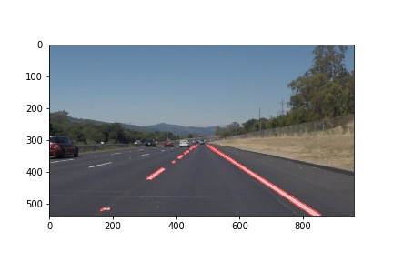
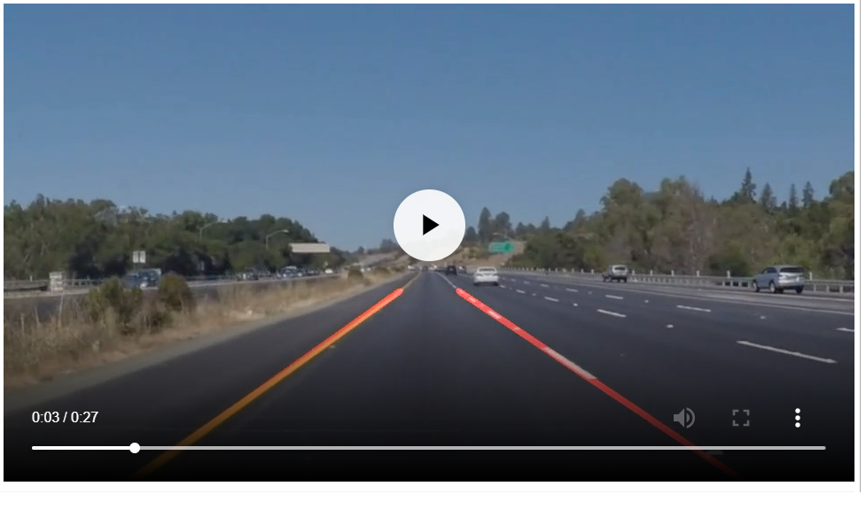

# **Finding Lane Lines on the Road** 

## Writeup Template

### You can use this file as a template for your writeup if you want to submit it as a markdown file. But feel free to use some other method and submit a pdf if you prefer.

---

**Finding Lane Lines on the Road**

The goals / steps of this project are the following:
* Make a pipeline that finds lane lines on the road
* Reflect on your work in a written report

[//]: # (Image References)

[image1]: ./examples/grayscale.jpg "Grayscale"

---

### Reflection

### 1. Describe your pipeline. As part of the description, explain how you modified the draw_lines() function.

##### First task of the project was to build the pipe line for the identification of lines and annotating them. Below are the steps which I have implemented for it
  * Converted the image to the gray scale
  * Applied Canny edge detection algorithm to detect the edges. 
       * Low threshold is 75 
       * High threshold is 200. 
  * Applied region of interest to filter outthe area which we are interested
  * Trasfomed the image using Hough transform to detect lines from the edges. Below are the hyper parameters I have used
      * rho = 1 # distance resolution in pixels of the Hough grid
      * theta = np.pi/180  # angular resolution in radians of the Hough grid
      * threshold = 20     # minimum number of votes (intersections in Hough grid cell)
      * min_line_length = 1 #minimum number of pixels making up a line
      * max_line_gap = 5    # maximum gap in pixels between connectable line segments
   * Then combined the original image with the Hough transformed image to get the output

##### Second task was to add a single line in the place of intermittent left and right lane. For that following steps I followed.
  
  * First task was to identify the left and right lines. This I have done using finding the slope. Since images origin is on top left, following scenarios will come.
      * If the slopes are positives, then the line will be on right side
      * Otherwise, it will be on the negative sides.
      Initially was getting alot of flutuation but once I ignored the slops which are less than 1/2, I got good result!
   * Finding the y coordinate was trivial (y_max will be the size of the image, y_min will be 60% of the max). But to find the x coordiate, I have used np.polyfit then applied np.poly1d functions. By using it, found x_min and x_max for both left and right lines
   * Added these lines to the image using cv.line API 

If you'd like to include images to show how the pipeline works, here is how to include an image: 

### 2. Identify potential shortcomings with your current pipeline

  * One of the obvious shortcoming in my submission I can see was, algorithm is not working properly for curved roads. I tried for various hyper-parameters for Optional challege, but could not make it work properly.  

### 3. Suggest possible improvements to your pipeline
  * As I mentioned in the shortcoming section, pipeline can be improved for detecting curved lines. 
  * 
